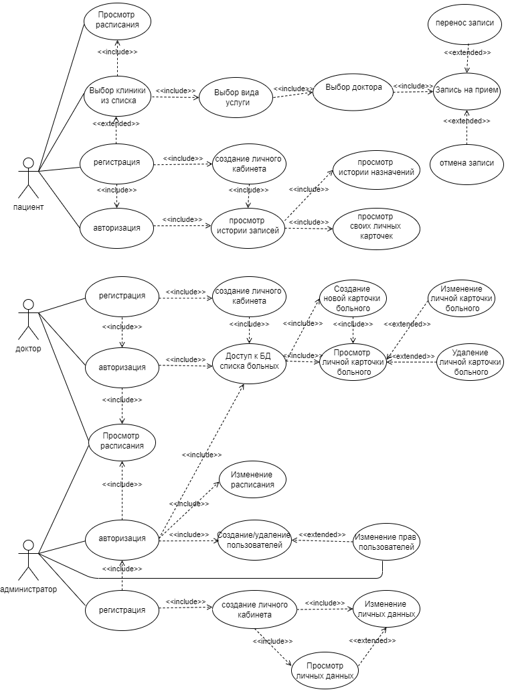
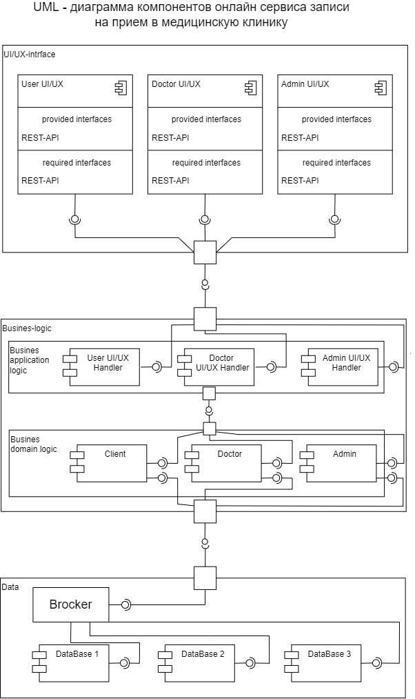

### Необходимо спроектировать сервис записи на приём к доктору

а. Доменная модель (клиника, пациент, доктор, вид услуги, расписание, ..), в виде текста. Домен – атрибуты.

Предметная область - онлайн сервис записи на услугу
Контекст - медицинские услуги

Доменная модель в виде текста домен-атрибут:

|Домен: |                  Атрибут:|
-----|-----
клиника |                   id клиники, название, адрес, перечень услуг;
Доктор |                    id доктора/специалиста, Ф.И.О., серия номер паспорта, номер СНИЛС, номер мед.полиса, дата рождения, адрес, телефон, эл.почта, диагнозы, записи на услуги, назначения личные карточки, переносы времени записей, отмены записей;
Пациент |                   id пациента, Ф.И.О., специализации, образование, стаж, адрес, телефон, эл.почта, пациенты, расписание работы, записи на прием, краткие анамнезы пациентов, истории болезни пацентов, назначения пациентов, исследования пациентов, диагнозы пациентов;
Администратор |             id администратора, Ф.И.О., расписание, список клиник, список врачей, список пациентов, список видов услуг, список записей на прием, список личных карточек пациентов, списки адресов пациентов, списки телефонов, списки эл.почты;
Расписание |                дата, время, id вида услуги, id доктора/специалиста, id пациента, доп.информация;
Вид услуги |                id вида услуги, наименование, стоимость, длительность, доп.информация;

б. Сценарии (выбор доктора, выбор времени, запись, перенос, отмена, приём, ..), в виде Актор – Прецедент (из первой лекции).

с. Адаптеры интерфейсов в виде компонент (подключение к БД, шлюзы к интерфейсу, шлюзы к третьим источникам)

d. Конкретные технологии (БД, фреймворки UX/UI, брокеры) – нужна помощь преподавателя, так как это темы будущих лекций.

Разработать полную ERD домена в https://www.dbdesigner.net/:

