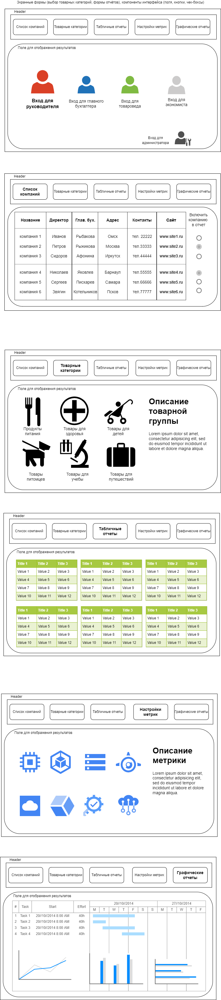

# Спроектировать сервис отчётов для компании оптовой торговли

## а) Доменная модель (компания, товарные категории, табличный отчёт, графики и диаграммы, финансовые показатели, ..), в виде текста Домен – атрибуты

## Решение

Доменная модель, означает выделение в какой-либо сфере бизнеса:

1. Предметной области (домена);
2. Ограниченного контекста (контекстов) в данной предметной области;
3. Единого языка (рабочей терминологии);

Для целей разработки модели следует, в рамках домена (предметной области), выделить также наиболее существенные
субдомены (подобласти).

Наиболее важным субдоменом из всех, внутри ограниченного контекста, является **смысловое ядро**.

Определим предметную область для компании из условия задачи: "Необходимо спроектировать сервис отчётов для компании оптовой торговли."

Предположим, что предметной областью компании является область оптовой торговли (в реальном кейсе такие вещи обсуждаются с заказчиком).

Итак,

1. **Домен** (т.е. предметная область) - **оптовая торговля**.

Ограничим контекст, в рамках которого выделим существенные субдомены, смысловое ядро и "единый язык" - терминологию.

В рамках поставленной задачи контекст заключается в разработке сервиса отчетов для компании оптовой торговли.

2. **В рамках контекста** сходу можно выделить два существенных субдомена - это:

**a)  Субдомен "сервис отчетов";**

**b)  Субдомен "компания оптовой торговли";**

При этом оба эти субдомена не являются смысловым ядром в рамках данного ограниченного контекста. Попробуем определить наиболее существенную предметную подобласть (субдомен) для данной компании.

Целью любой коммерческой компании является извлечение прибыли, однако пути достижения этой цели разные. Спецификой данной компании является оптовая торговля.

Оптовая торговля предполагает торговлю большими партиями товара, по цене, существенно ниже, чем в
розничной торговле. Прибыль зависит от оборота товара, то есть от темпа продаж.

Это значит, что критически важно, чтобы на складах компании был товар, на который всегда есть устойчивый спрос.
Очевидно, что такие товары известны и конкурентам, а потому увеличение эффективности на данном поле, скорее всего,
возможно лишь не существенно.

Однако, если верно спрогнозировать спрос на другие категории товаров, то можно получить конкурентное преимущество.

Таким образом смысловым ядром сервиса отчетов может быть

 **область верного прогнозирования спроса на товары,**

то есть основной задачей сервиса, его смыслом, может являться задача предоставления руководству компании возможности делать, на основе анализа массива информации по продажам, ценам, верное прогнозирование спроса на товары.

Инструментами, с помощью которых данный сервис предоставляет такую возможность являются отчеты, графики, диаграммы и т.п.

Также, к смысловому ядру можно отнести область оптимизации расходов, за счет эффективного использования складских площадей, эффективным управление трудовыми ресурсами на основе анализа, сделанного при помощи сервиса отчетов.

Таким образом мы определились и ограничили контекст данного сервиса, это:

### предоставление аналитической информации для прогнозирования спроса на товары, в виде отчетов, графиков и диаграмм для руководства компании оптовой торговли

Определим требования, которым должен удовлетворять **"единый язык"** в субдомене **"сервис отчетов"**:

Предположим, что это:

1. Сервис, к которому имеют доступ только сотрудники компании;
2. У данных сотрудников должны быть разные роли при доступе к сервису;
3. В соответствии с ролями должны быть определены их права и возможности;
4. Сервис должен предоставлять в соответствии с ролью пользователя определенный набор доступных функций;
5. Сервис(вероятно) служит целям аналитики и контроля со стороны менеджмента компании;

**Термины (единый язык):** личный кабинет, права, пользователь, логин, пароль, интерфейс пользователя, администратор, интерфейс администратора, анализ продаж, анализ цен, анализ прибыли, график, вид графика(диаграммы), разрешение, единицы измерения, оси, значения, диаграмма, отчет, вид отчета, категория, столбцы, строки, шапка, подписи;

Определим требования, которым должен удовлетворять **"единый язык"** в субдомене **"компания оптовой торговли"**:

Предположим, что это:

1. Торговля крупными партиями товара;
2. Более низкие цены на соответствующие позиции чем в рознице;
3. Наличие складских помещений и складской инфраструктуры;
4. Необходимость анализа и контроля над логистикой товарных потоков компании;
5. Необходимость содержать штат сотрудников, обеспечивающих производственные процессы;

**Термины (единый язык):** название, адрес, контакты, сайт, директор, главный бухгалтер, категория товара, цена, поставщик, производитель, тара, фасовка, объем, вес, срок годности, себестоимость, рентабельность, чистая выручка, прибыль, убыток, задолженность;

Доменная модель в виде текста домен-атрибут:

|Домен: |                  Атрибут:|
-----|-----
Компания: | идентификатор, название, адрес, контакты, сайт, директор, главный бухгалтер
Товарные категории: | идентификатор, категория, цена, поставщик, производитель, тара, фасовка, объем, вес, срок годности
Табличный отчет: | идентификатор, вид отчета, категория, столбцы, строки, шапка, подписи
Графики и диаграммы: | идентификатор, вид графика(диаграммы), разрешение, единицы измерения, оси, значения
Финансовые показатели: | себестоимость, рентабельность, чистая выручка, прибыль, убыток, задолженность

### б) Экранные формы (выбор товарных категорий, формы отчётов), компоненты интерфейса (поля, кнопки, чек-боксы, ..), инструменты -  <https://www.figma.com/>  или  <https://app.diagrams.net/>

Нарисуем примерную компоновку сайта, укажем необходимые компоненты интерфейса в первом приближении:

Таким образом, нам потребуются следующие компоненты для воплощения интерфейса пользователя:

1. компонент "Кнопка";
2. компонент "Радиокнопка";
3. компонент "Плитка";
4. компонент "Элемент навигации";
5. компонент "Превью";
6. компонент "Контент";

### с) Определить тип подходящей для этого контента архитектуры ( SPA CSR, SSR)

Для такой компоновки подходит вариант SPA приложения, то есть одностраничного приложения. Обновлятся при этом будет только часть страницы "Поле для отображения результатов". Так как данное поле достаточно насыщенно разного рода информацией, рендеринг страницы возложим на сервер, в предположении, что сервер у предприятия выделенный. То есть сборка пользовательского интерфейса производится по модели SSR, то есть на стороне сервера, это позволит грузить странички быстрее.

Итог: архитектура CPA, SSR.

### d) Сформировать компоненты бизнес-логики (функциональные)необходимые для построения этих отчётов. Показать связь между компонентами интерфейса и компонентами бизнес-логики. На диаграмме или текстовым описанием

Для работы данного приложения лучше всего подходит модель MVP. Таким образом основа бизнес логики будет построена на компонентах "Model", "View", "Presenter". Кроме того потребуются компоненты "Avtorization", "Repository", "Employees", "Calculations".

Компонент "Model" отвечает за бизнес логику приложения, выполняет основные расчеты и работу с данными, обращения к базе данных и другим вспомогательным компонентам.
Компонент "View" - по факту является компонентом, который отвечает за формирование готовой странички и ее рендеринг, до отправки пользователю.
Компонент "Presenter" - компонент фактически согласует работу компонентов "View" и "Model".
Компонент "Avtorization" - является отдельным классом, обеспечивающим авторизацию.
Компонент "Repository" - является интерфейсом, который отвечает за работу с базой данных.
Компонет "Employees" - является классом, для создания объекта пользователя на период его сеанса.
Компонент "Calculations" - является вспомогательным компонентом, для выполнения вычислений для отображения пользователю.

1. На первом экране компоненты интерфейса пользователя становятся активными только после авторизации. Для авторизации требуется нажать на элемент навигации в виде закрашенного контурного изображения человека, после чего откроется окно, связанное с компонентом бизнес-логики авторизации. Соответственно, компонент бизнес-логики "View" сообщает компоненту "Presenter", что сделан выбор, в соответствии с этим выбором "Presenter" дает команду компоненту "Model" запустить компонент "Authorization". Компонент "Authorization" отправляет компоненту "Model" данные для отображения компонентом "View", которые "model" передает в "Presenter" и далее компоненту "View".
2. На втором экране, при помощи переключателя "Радиокнопка", выбираются компании, для включения в итоговый отчет. Таким образом, с данным экраном связан компонент бизнес логики "Presenter", получающий от компонента "View" выбор пользователя, после чего отдает команду компоненту "Model" сохранить его во временном хранилище для дальнейшего использования при построении отчетов.
3. На третьем экране с компонентами "Плитка" связаны с компонентом бизнес-логики "Presenter", который обращается к компоненту "Model", чтобы он запросил и предоставил нужные данные из БД. После чего он направляет эти данные компоненту "View" для показа.
4. На последующих экранах ллогика взаимодействия компонентов и интерфейса происходит аналогично.