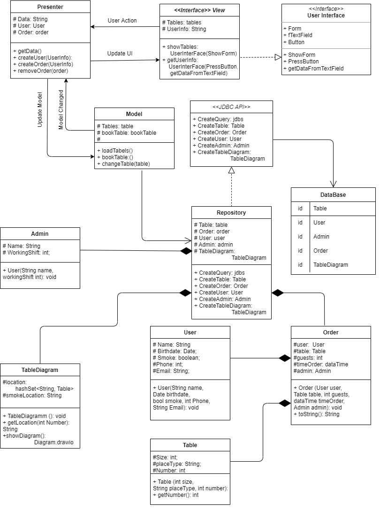

# Необходимо спроектировать сервис бронирования столика в ресторане. C полями ввода данных о пользователе и заказе, возможностью выбора столика и с кнопкой подтверждения заказа

а. Доменная модель, в виде текста Домен – атрибуты.

Доменная модель - предметная область, в данном случае контекст - общепит
Домен - Общепит (ресторан)

1. пользователь: Ф.И.О., дата рождения, курящий/некурящий, телефон, емейл;
2. столик: количество мест, категория;
3. заказ: пользователь, столик, количество гостей, время заказа, администратор;
4. схема столиков: зоны размещения, зона для курящих/не курящих;
5. администратор: Ф.И.О., смена;

б. Экранные формы, компоненты интерфейса (поля, кнопки, чек-боксы, ..), инструмент [https://www.figma.com/](https://www.figma.com/) или [https://app.diagrams.net/](https://app.diagrams.net/)

с. Определить программные модули

## Model

Работа с данными: запрос, сохранение или изменение данных в БД или файлах.

Реализовать три метода, которые вызываются презентером: **loadTabels** - получение списка всех столиков со статусом (свободно, забронировано);

**bookTable** – бронирование столика;

**changeTable** – поменять бронь столика.

**Presenter** вызывает эти методы и он не знает как эти методы реализованы в Model

## View

Отвечает за отображение данных на экране и за обработку действий пользователя.

Здесь резализованы методы, вызываемые **Presenter**:

**showTables** - отображение списка столиков;

**getUserInfo** – сбор данных о пользователе (имя, номер телефона, время, количество персон)

Во **View** не должно быть никакой логики. **View** это способ вывода данных (UI) и взаимодействия (UX) с пользователем.

Действия пользователя передаются в **Presenter**. По нажатию кнопки  «подтверждения заказа», **View** сразу сообщает об этом **Presenter**. **Presenter** принимает это к и действует по своему алгоритму.

## Presenter

Является связующим звеном между **View** и **Model**, которые не должны общаться напрямую.

От **View** **Presenter** получает данные о том, какие кнопки были нажаты пользователем, и решает, как отреагировать на эти нажатия. Если надо что-то отобразить, то **Presenter** сообщает об этом **View**. А если нужно сохранить/получить данные, **Presenter** использует **Model**.

Шаги взаимодействия **View**, **Presenter** и **Model**:

1. **Presenter** просит **Model** дать ему данные из БД о занятости столиков.
2. **Presenter** просит **View** показать данные о столиках.
3. Пользователь выбирает подходящий столик и вводит свои данные в поля ввода. Это не обрабатывается и ничего не происходит.
4. Пользователь жмет кнопку «подтверждения заказа».
5. **View** сообщает **Presenter** о том, что была нажата кнопка «подтверждения заказа».
6. **Presenter** просит **View** дать ему данные, которые были введены пользователем в поля ввода.
7. **Presenter** проверяет эти данные на корректность.
8. Если они некорректны, то **Presenter** просит представление показать сообщение об этом.
9. Если данные корректны, то **Presenter** просит представление показать прогресс-бар и просит **Model** добавить данные в базу данных.
10. **Model** выполняет вставку данных и сообщает **Presenter**, что вставка завершена.
11. **Presenter** просит представление убрать прогресс-бар.
12. **Presenter** запрашивает данные о подтверждении бронирования у **Model**.
13. **Model** возвращает данные **Presenter**.
14. **Presenter** просит **View** показать новые данные.
15. **Presenter** управляет всем происходящим. Он указыват **View** и **Model** что делать и как реагировать на действия пользователя.
